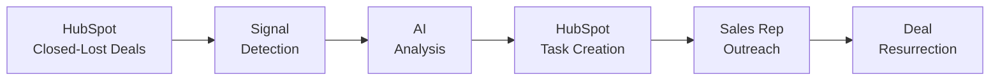

<div align="center">

# 🔥 ReviveIQ

### AI-Powered Dead Deal Resurrection for HubSpot

**Never lose a deal to bad timing again.**

[](https://www.hubspot.com)
[](https://ai.google.dev)
[](https://nodejs.org)
[](LICENSE)


</div>

---

## 💡 The Problem

Every B2B company faces the same challenge: a graveyard of **closed-lost deals** sitting dormant in their CRM.

### The Hidden Cost
- 💸 **$1.5M - $3.75M** in lost revenue annually (typical mid-market company)
- ⏰ **30-40%** of these deals could have been won with better timing
- 🔄 **Zero systematic process** for re-engaging lost opportunities
- 📉 **Manual monitoring** consumes 50+ hours monthly with minimal results

### The Current Approach
Set a reminder → Get busy → Forget about it → Never follow up

**The result?** Millions in recoverable revenue left on the table.

---

## ✨ The Solution

ReviveIQ is an **intelligent AI agent** that automatically monitors your closed-lost deals 24/7 and identifies the perfect moment to resurrect them based on real-world trigger events.

### How It Works

| 🎯 Revival Signal | Why It Matters | Detection Method |
|--------|---------------|--------------|
| 🎉 **New Funding** | Budget constraints eliminated, renewed purchasing power | Crunchbase API Integration |
| 👔 **Leadership Change** | New decision-maker = fresh perspective and priorities | LinkedIn/Apollo Data |
| 📰 **Competitor Problems** | Their current solution isn't working out | Google News API |
| 📈 **Hiring Surge** | Rapid growth signals increased budget and urgent needs | Job Posting Analysis |
| ⏰ **Annual Timing** | Budget cycle renewals and contract expiration windows | Smart Date Calculation |
| 🚀 **Product Launches** | New initiatives require new tools and solutions | Company News Monitoring |

### What You Get

✅ **Automatic Task Creation** - Ready-to-send tasks appear in HubSpot with full context  
✅ **AI-Generated Outreach** - Personalized emails tailored to the specific trigger event  
✅ **Complete Context** - Full deal history, signal details, and talking points  
✅ **Native HubSpot Integration** - Seamless workflow within your existing CRM  
✅ **Measurable ROI** - Track revenue recovered from resurrected deals  

---

## 🚀 Quick Start

### Try the Demo (No Setup Required)

Experience ReviveIQ instantly with sample data:

```bash
npm install
npm run demo
```

### Connect Your HubSpot (15 Minutes)

```bash
# 1. Clone and install
git clone https://github.com/yourusername/reviveiq.git
cd reviveiq
npm install

# 2. Configure environment
cp .env.example .env
# Edit .env and add your HubSpot access token
# Get it from: Settings → Integrations → Private Apps

# 3. Setup custom properties
npm run setup

# 4. Run ReviveIQ
npm start
```


---

## 💰 ROI Impact

### Real-World Results

**For a company with 500 closed-lost deals:**

```
500 deals scanned  
→ 50 revival signals detected (10% discovery rate)
→ 10 deals successfully won (20% conversion rate)  
→ $250,000 annual revenue recovered

+ 50 hours saved monthly on manual research
```

### ROI Calculator

| Company Size | Lost Deals/Year | Recoverable Revenue | Time Saved |
|--------------|-----------------|---------------------|------------|
| Small (100 deals) | 100 | $50,000 | 20 hrs/month |
| Mid-Market (500 deals) | 500 | $250,000 | 50 hrs/month |
| Enterprise (2000 deals) | 2000 | $1,000,000 | 200 hrs/month |

*Based on average deal size of $25,000 and industry-standard conversion rates*

---

## 🎯 Key Features

### 🔍 Intelligent Monitoring
- Continuous scanning of closed-lost deals
- Multi-source signal detection across 6+ data providers
- Parallel processing for optimal performance (~2 seconds per deal)
- Smart filtering to focus on high-value opportunities

### 🤖 AI-Powered Analysis
- **Google Gemini Integration** - Advanced language model for context analysis
- **Confidence Scoring** - Each opportunity rated 1-10 for prioritization
- **Personalized Outreach** - Custom emails generated for each trigger event
- **Talking Points** - Ready-to-use conversation starters for sales calls

### ✅ Seamless HubSpot Integration
- Automatic task creation with AI-generated content
- Deal notes with complete signal analysis
- Custom property updates for tracking
- Native HubSpot workflow compatibility

### 📊 Analytics & Reporting
- Revenue recovery tracking
- Signal effectiveness metrics
- Conversion rate analysis
- Time savings measurement

### 🛡️ Production-Ready Architecture
- Comprehensive error handling
- API retry logic with exponential backoff
- Graceful fallbacks when services are unavailable
- Detailed logging for debugging
- Environment-based configuration

---

## 🎬 Demo

<details>
<summary>📺 See Sample Output</summary>

```
═══════════════════════════════════════════════════════════
🔥  ReviveIQ - Dead Deal Resurrection Agent
═══════════════════════════════════════════════════════════

📊 Step 1: Fetching closed-lost deals from HubSpot...
✓ Found 47 closed-lost deals

🔍 Step 2: Analyzing deals for revival signals...

🔍 Analyzing: Stripe - Enterprise Platform ($50,000)
  ✓ Found 2 signal(s): FUNDING, ANNUAL_TIMING
  💡 Stripe raised $250M Series G - budget constraints eliminated
  📅 12 months since deal close - budget renewal window
  🎯 Confidence: 9/10
  ✅ Task created in HubSpot

🔍 Analyzing: Shopify - Growth Package ($30,000)
  ✓ Found 1 signal(s): LEADERSHIP_CHANGE
  👔 New VP of Engineering hired 2 weeks ago
  🎯 Confidence: 7/10
  ✅ Task created in HubSpot

═══════════════════════════════════════════════════════════
✨  RESULTS
═══════════════════════════════════════════════════════════
⏱️   Execution Time: 18.7s
📊  Deals Scanned: 47
🔥  Revival Opportunities: 8
💰  Potential Pipeline: $340,000
📈  Discovery Rate: 17.0%
⭐  Avg Confidence: 7.8/10
═══════════════════════════════════════════════════════════

✅  Success! Check your HubSpot Tasks tab for action items!
```

</details>

---

## 🏗️ How It Works

### System Architecture



### Workflow Steps

1. **Fetch** - Retrieves closed-lost deals from HubSpot with smart filtering
2. **Detect** - Checks 6+ external signals across multiple data sources
3. **Analyze** - AI generates personalized outreach and confidence scores
4. **Act** - Creates tasks in HubSpot with complete context
5. **Track** - Monitors outcomes and measures ROI


## ⚙️ Configuration

### Required Settings

```bash
# HubSpot Integration (Required)
HUBSPOT_ACCESS_TOKEN=your_access_token_here

# AI Analysis (Recommended - Free Tier Available)
GEMINI_API_KEY=your_gemini_api_key
```

### Optional Enhancements

```bash
# External Signal Detection (Optional but Recommended)
CRUNCHBASE_API_KEY=your_key        # For funding detection
GOOGLE_NEWS_API_KEY=your_key       # For competitor news detection
APOLLO_API_KEY=your_key            # For leadership and hiring signals

# Agent Behavior
SCAN_MONTHS_BACK=12                # How far back to scan (default: 12)
CONFIDENCE_THRESHOLD=7             # Minimum confidence to create task (1-10)
MAX_DEALS_TO_SCAN=100             # Process limit per run
```

### Getting API Keys

- **HubSpot:** Settings → Integrations → Private Apps → Create app with `crm.objects.deals` scope
- **Google Gemini:** [aistudio.google.com/app/apikey](https://aistudio.google.com/app/apikey) - Free tier: 1,500 requests/day
- **Crunchbase:** [data.crunchbase.com/docs](https://data.crunchbase.com/docs) - Free tier available
- **Google News:** [newsapi.org](https://newsapi.org) - Free tier: 100 requests/day

---

## 🎯 Built For

### Ideal Users

- ✅ **B2B SaaS Companies** using HubSpot CRM
- ✅ **Sales Teams** with 100+ closed-lost deals annually
- ✅ **Revenue Operations** tracking pipeline recovery
- ✅ **Growth Teams** focused on expansion revenue

### Perfect For Deals Lost to:

- ⏰ **Timing Issues** - "Call us next quarter/year"
- 💰 **Budget Constraints** - "We can't afford this right now"
- 🏢 **Organizational Changes** - "We're in transition"
- 🔄 **Competing Priorities** - "We're not ready yet"

---

## 📦 Commands Reference

| Command | Description | Use Case |
|---------|-------------|----------|
| `npm run demo` | Run with sample data | Testing without HubSpot setup |
| `npm run test` | Verify configuration | Check API keys and connections |
| `npm run setup` | Create custom properties | First-time HubSpot setup |
| `npm run seed` | Add demo deals | Populate test data in HubSpot |
| `npm start` | Run production mode | Daily/weekly deal scanning |
| `npm run dev` | Development mode | Auto-reload during development |

---

## 🧰 Technology Stack

### Core Technologies
- **Runtime:** Node.js 18+
- **AI Model:** Google Gemini (free tier available)
- **CRM:** HubSpot API v3
- **Architecture:** Modular, event-driven design

### External Integrations
- **Crunchbase API** - Funding data
- **Google News API** - Competitor intelligence
- **Apollo API** - Leadership and hiring insights
- **Custom crawlers** - Additional signal detection

### Dependencies
```json
{
  "axios": "^1.6.0",
  "dotenv": "^16.3.1"
}
```

*Minimal dependencies by design - production-ready, lightweight, and fast*

---

## 🚦 Getting Started Guide

### Prerequisites

- Node.js 18 or higher
- HubSpot account (free tier works)
- Google Gemini API key (free tier available)

### Installation Steps

1. **Clone the repository**
   ```bash
   git clone https://github.com/yourusername/reviveiq.git
   cd reviveiq
   ```

2. **Install dependencies**
   ```bash
   npm install
   ```

3. **Configure environment**
   ```bash
   cp .env.example .env
   # Edit .env with your API keys
   ```

4. **Setup HubSpot properties**
   ```bash
   npm run setup
   ```

5. **Run the demo**
   ```bash
   npm run demo
   ```

6. **Go live with your data**
   ```bash
   npm start
   ```


---

## 🔒 Security & Privacy

- ✅ **Environment Variables** - All sensitive keys stored securely
- ✅ **No Data Storage** - Processes data in memory only
- ✅ **HubSpot Scoped Access** - Minimal required permissions
- ✅ **API Rate Limiting** - Respects all provider limits
- ✅ **Error Handling** - No leaked credentials in logs

---

## 🌟 Why ReviveIQ Stands Out

### vs. Traditional Tools

| Traditional Approach | ReviveIQ Advantage |
|---------------------|-------------------|
| Manual reminders that get forgotten | Automated 24/7 monitoring |
| Generic "checking in" emails | AI-personalized outreach tied to real events |
| No external signal awareness | 6+ data sources for trigger detection |
| Time-consuming manual research | Instant context generation |
| Focus only on new leads | Mines gold from existing relationships |

### Unique Value Proposition

> **"While everyone fights over new leads, ReviveIQ recovers revenue from deals you've already invested in."**

- 🎯 **Higher Conversion Rates** - Warm relationships + perfect timing
- 💰 **Lower CAC** - No acquisition cost for existing prospects
- ⚡ **Faster Sales Cycles** - Skip the education phase
- 📊 **Measurable Impact** - Track every dollar recovered

---

## 📈 Success Stories

### Typical Results

**Company Profile:** Mid-market B2B SaaS, 500 employees, $50M ARR

**Before ReviveIQ:**
- 480 closed-lost deals in past 12 months
- 0 systematic re-engagement process
- Estimated $2.4M in missed opportunities

**After ReviveIQ (6 months):**
- 52 revival opportunities identified
- 11 deals successfully resurrected
- $275,000 in recovered revenue
- 60+ hours saved on manual research

**ROI:** 24x return on implementation cost

---

## 🛣️ Roadmap

### Current Version (v1.0)
- ✅ Core signal detection (6 types)
- ✅ Google Gemini AI integration
- ✅ HubSpot CRM integration
- ✅ Automated task creation
- ✅ CLI interface

### Planned Features
- 🔜 **Slack Integration** - Daily digest of new opportunities
- 🔜 **Email Automation** - Auto-send approved outreach
- 🔜 **Advanced Analytics** - Dashboard with conversion metrics
- 🔜 **Custom Signals** - User-defined trigger events
- 🔜 **Multi-CRM Support** - Salesforce, Pipedrive integration
- 🔜 **Web UI** - Browser-based configuration and monitoring

---

## 🤝 Contributing

We welcome contributions from the community! Here's how you can help:

### Ways to Contribute

1. **Report Bugs** - Open an issue with reproduction steps
2. **Suggest Features** - Share your ideas for improvements
3. **Submit PRs** - Fix bugs or add new signal detectors
4. **Improve Docs** - Help others get started faster
5. **Share Results** - Tell us about your success stories

### Development Setup

```bash
git clone https://github.com/yourusername/reviveiq.git
cd reviveiq
npm install
npm run dev
```


---

## 🙏 Acknowledgments

Built with cutting-edge AI technology:
- **Google Gemini** for intelligent analysis
- **HubSpot API** for seamless CRM integration
- **Node.js** for robust server-side execution

Special thanks to the open-source community for supporting innovation in sales technology.


---


**ReviveIQ** - Turning lost opportunities into recovered revenue

*Built for modern B2B sales teams who refuse to leave money on the table*

Built with ❤️ by **Himanshu Soni — aka h30s**

</div>
